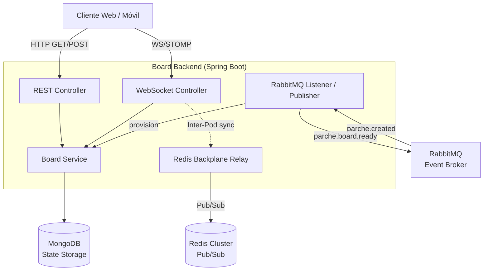
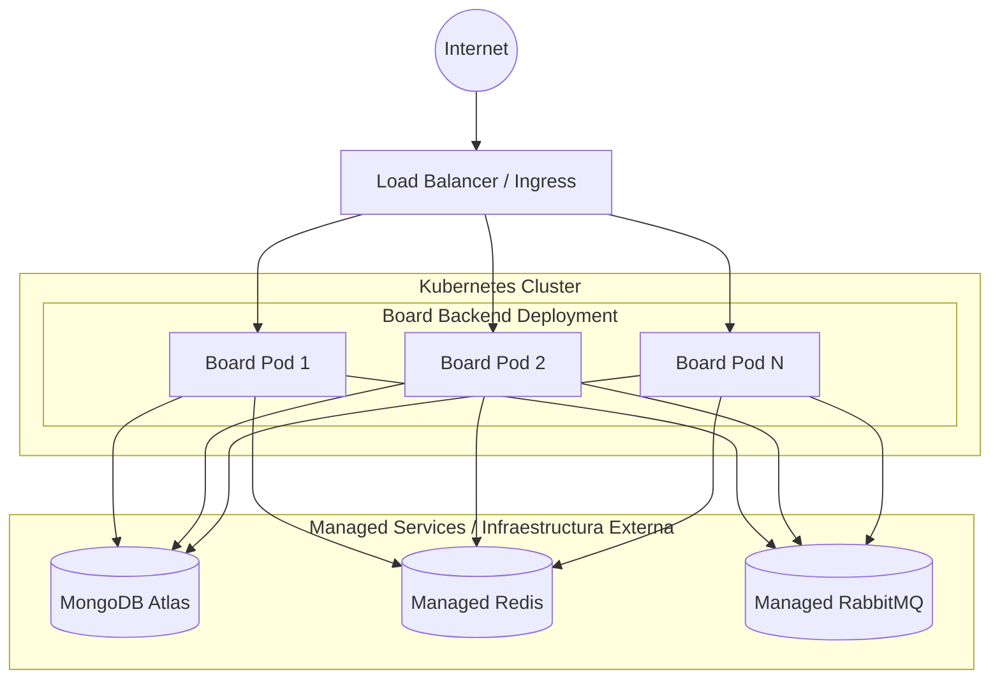

# Board Backend Microservice

Este microservicio es responsable de gestionar el estado y la comunicación en tiempo real de las pizarras colaborativas ("whiteboards"). Forma parte del ecosistema y se encarga de habilitar la colaboración sincronizada entre múltiples usuarios que editan el mismo tablero simultáneamente.

## ¿Qué hace el microservicio?

1. **Gestión en Tiempo Real:** Utiliza WebSockets (STOMP) para enviar y recibir trazos (`strokes`) y posiciones de cursores de los usuarios en tiempo real.
2. **Sincronización Multi-nodo (Backplane):** Implementa un patrón de *Backplane* usando Redis Pub/Sub. Esto permite que el servicio escale a múltiples instancias (pods). Si dos usuarios están conectados a distintas instancias de la aplicación pero en el mismo tablero, Redis se encarga de rutear los eventos de WebSocket entre las instancias.
3. **Persistencia de Estado:** Almacena la verdad absoluta del tablero en MongoDB. A diferencia de un simple *broadcast*, cualquier trazo nuevo se consolida en la base de datos para que los nuevos participantes puedan cargar el tablero completo al unirse.
4. **Integración Orientada a Eventos:** Escucha eventos de dominio a través de RabbitMQ (AMQP). Por ejemplo, al recibir el evento `parche.created`, el microservicio provisiona una nueva pizarra de manera asíncrona y emite el evento de integración `parche.board.ready`.

---

## Parámetros de Calidad y Principios de Diseño

El proyecto ha sido diseñado siguiendo estándares de alta calidad y buenas prácticas:

* **Principios SOLID:**
  * *Single Responsibility Principle (SRP):* Separación clara entre Controladores REST (`BoardController`), WebSockets (`BoardWebSocketController`), Lógica de Negocio (`BoardService`), Mensajería asíncrona (`ParcheCreatedListener`) y comunicación inter-pod (`RedisBackplanePublisher`).
  * *Dependency Inversion Principle (DIP):* Uso de inyección de dependencias a lo largo del framework de Spring Boot, desacoplando los componentes a través de interfaces implícitas y constructores inyectados.
* **Alta Disponibilidad y Escalabilidad Horizontal:** Diseñado sin estado ("stateless") en la capa de aplicación, delegando el estado efímero en memoria al Redis Backplane y la persistencia a MongoDB.
* **Tolerancia a Fallos:** Configuración de *Health Probes* (liveness, readiness) a través de Spring Boot Actuator para integrarse perfectamente con los mecanismos de resiliencia de Kubernetes.
* **Testing y Code Coverage:** Se impone un *Coverage Gate* utilizando JaCoCo (mínimo 60% en líneas, 50% en branches) en el pipeline de CI/CD para garantizar que el core de la lógica de negocio esté bien probado.

---

## Diagrama de Arquitectura

El siguiente diagrama detalla cómo interactúan los componentes lógicos del microservicio con el exterior:

---

## Diagrama de Despliegue

El despliegue está diseñado para infraestructuras *Cloud Native* utilizando Kubernetes.

## Tecnologías Principales

* Java 21
* Spring Boot 3.2.4
* Spring Web, Spring WebSockets
* Spring Data MongoDB
* Spring AMQP (RabbitMQ)
* Spring Data Redis (Backplane)
* Reactor Netty
* JaCoCo (Coverage)
* OpenAPI / Swagger UI